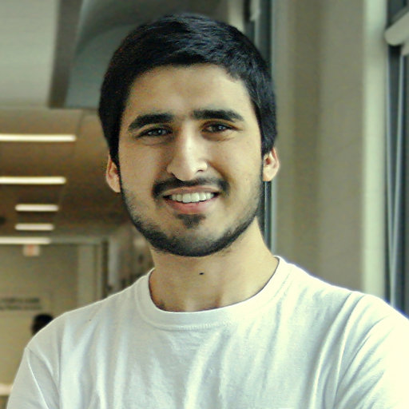

---
output:
  html_document:
    css: ['./css/columns.css','./css/main.css']
    toc: true
    toc_float: true
    toc_collapsed: true
toc_depth: 3
title: "About - Tayab Soomro"
number_sections: true
theme: readable
---

:::::: {.center}

### Tayab Soomro

--------------

*I work as a Senior Computational Biologist @ FoodImprover Inc.*

::::::

# Current

- Senior Computational Biologist [FoodImprover](https://www.foodimprover.com)
- Founder and CEO [PathoScan](https://pathscan.com)

# Interests

Genomics • Software Engineering • Automation • Machine Learning

# Past Employment

- (2020 - 2023) **Computational Biologist** @ [NRGene Canada Inc.](https://nrgene.com)    

- ( 2020 ) **Independent web dev contractor** @ [Luxsonic Technologies](https://luxsonic.ca/)   

- (2019 - 2020) **Student Bioinformatician** @ <abbr title="Agriculture & Agri-Food Canada, Saskatoon Research & Development Centre, Saskatoon, Saskatchewan, Canada">AAFC</abbr>   

- (2017 - 2019) **Student Research Assistant** @ [Links Lab](https://agbio.usask.ca/faculty-and-staff/people-pages/matthew-links.php#research_areas), University of Saskatchewan  

# Education

- **M.Sc. Agriculture** (2020 - 2022) 
*Institute of Comparative Genomics, Faculty of Agriculture @ Dalhousie University*

- **B.Sc. (Honours) Bioinformatics** (2015 - 2020) 
*Department of Computer Science, University of Saskatchewan*

