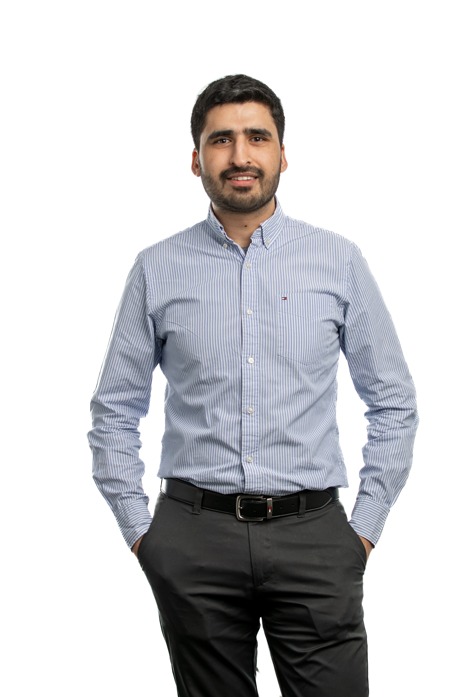

---
output:
  html_document:
    css: ['./css/columns.css','./css/main.css']
theme: readable
title: "Tayab Soomro"
---

  

  

  <h1 class="tayab">TAYAB SOOMRO</h1>
  
  

  

  

  <h3>I AM A</h3>
  <b>Software Engineer · Computational Biologist · Data Scientist</b>
  

  <h3>I AM CURRENTLY</h3>
  <ul class="left" style="float:left !important">
  <li>a <b>Founder</b> at <a href="https://pathoscan.com">PathoScan</a></li>
  <ul>
    <li>a revolutionary crop diagnostic solution</li>
  </ul>
  </ul>
   
  

  <h3>I AM INTERESTED IN</h3>
  <ul class="left">
  <li><b>Genomics:</b> GWAS, QTL, Variant Calling, Assembly, Annotation</li>
  <li><b>Devleopment:</b> Pipelines, Dashboards, Apps</li>
  <li><b>Data Analysis:</b> Statistical Analysis, Business Intelligence</li>
   
  
Whatever else that is interesting...

  </ul>
  <h3>LET'S CHAT!</h3>
  If you are interested in collaborating with me on a project, please <a href="https://calendly.com/avro/tayabsoomro">set up a meeting with me</a>. I am looking forward to working with you!
  

